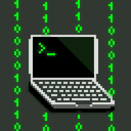

# 👋 Hey, I'm Hellokhe

Creator of **zenOS**! It's a hobby Unix-like operating system.

  

## zenOS

- Custom kernel
- POSIX-inspired userspace
- X11 desktop
- TCC support
- Ports of Doom and ClassiCube
- Thousands of lines of code
- And more!

## Languages I know

### zenOS will be released soon...
